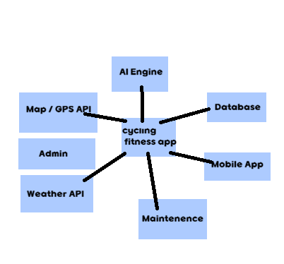

#(project title)
##마이 사이클링 다이어리(My Cycling Diary)

#logo

##Info
- Student No: 00000000
- Name: 홍길동
- E-mail: example@email.com

## Revision History

| Revision date | Version | Description | Author |
| 2026-03-26 | 1.0 | First draft | 김경훈 |

# = Contents =
1. Business purpose  
2. System context diagram  
3. Use case list  
4. Concept of operation  
5. Problem statement  
6. Glossary  
7. References

## 1.  1. Business purpose
코로나시기에 자전거를 타는 사람들이 급증하였고 이로 인해 로드사이클 분야와 같이 깊이 있는 자전거 취미가 커졌다. 자전거는 타인 혹은 자신의 기록과 경쟁하는데 대표적으로 PR(Personal Record)혹은 kom(King of mountain)과 같은 기록 측정하는 요소가 자전거 라이더들 사이에서 라이딩에 대한 중요한 기록 지표로 남게되었다. 2024년 해외 유명선수들이 한국에 내한할 정도로 국내 자전거와 관련된 시장은 커졌으나 가장 보편적이고 이용자가 많던 STRAVA라는 자전거 기록 측정앱이 한국에서 서비스를 종료하여 더 이상 이용할 수 없게 되었다. 기존 영어만 지원되고 부분 유료화로 제기능을 이용할수 없던 앱들이 불편하다는 국내 사용자들이 많았기에 외국기업의 외국에 최적화된 앱이 아닌 한국인들이 이용가능한 앱을 만들어보게 되었다.
기존 사람들이 가장 많이 이용하던 앱은 거리, 심박수, 평균속도, 케이던스, 이용자들이 정한 구간에 대한 시간이 기록만 되었었는데 라이딩 이외의 여러 기록경쟁에 도움이 되는 앱을 만들고자 한다.
-거리 심박수 평균속도 케이던스와 같은 기존 보편적인 라이딩 기록앱과 같은 기록기능
-기록 단축을 위한 ai를 통한 식단 추천
-리커버리(운동후 회복), 추천 웨이트 트레이닝
-최신 자전거 식단, 피팅 트렌드와 같은 기능을 넣어 라이딩 퍼포먼스 증진과 함께 운동에 더욱 집중할수 있는 시스템을 구축하고자 한다.

## 2. System context diagram

## 3. Use case list

# 3. Use case list

| No | Use case | Actor | Description |
| 1 | Register | User | 사용자가 회원가입을 통해 계정을 생성한다 |
| 2 | Login | User | 사용자가 ID와 비밀번호로 로그인한다 |
| 3 | Record Ride | User | 라이딩 거리, 속도, 심박수 등의 데이터를 기록한다 |
| 4 | View Ride Data | User | 자신의 라이딩 기록을 조회한다 |
| 5 | Analyze Performance | System | 입력된 데이터를 기반으로 운동 성과를 분석한다 |
| 6 | AI Recommendation | System | 사용자 데이터 기반으로 식단 및 회복을 추천한다 |
| 7 | View Recommendation | User | AI가 제공한 식단 및 회복 정보를 확인한다 |
| 8 | Manage User | Admin | 관리자가 사용자 정보를 관리한다 |
| 9 | Manage Data | Admin | 관리자가 데이터 및 시스템을 관리한다 |
| 10 | Sync External Data | System | 외부 API(날씨, GPS 등)와 데이터를 연동한다 |

# 4. Concept of operation

## 1) Register

| 항목 | 내용 |
| Purpose | 사용자 계정 생성 |
| Approach | 사용자가 닉네임, 메일, 비밀번호 등을 입력하여 회원가입 |
| Dynamics | 앱 최초 사용 |
| Goals | 사용자 계정을 생성하여 서비스 이용 가능 |

## 2) Login

| 항목 | 내용 |
| Purpose | 사용자 인증 |
| Approach | ID와 비밀번호를 입력하면 서버에서 검증 |
| Dynamics | 앱 실행 시 |
| Goals | 인증된 사용자만 기능 이용 가능 |

## 3) Record Ride

| 항목 | 내용 |
| Purpose | 라이딩 데이터 기록 |
| Approach | 거리, 속도, 심박수, 케이던스 등을 입력 또는 자동 측정 |
| Dynamics | 라이딩 수행 중 |
| Goals | 정확한 운동 데이터 저장 |

## 4) View Ride Data

| 항목 | 내용 |
| Purpose | 기록 조회 |
| Approach | 서버에 저장된 데이터를 불러와 화면에 표시 |
| Dynamics | 사용자가 조회 요청 시 |
| Goals | 자신의 운동 기록 확인 |

## 5) AI Recommendation

| 항목 | 내용 |
| Purpose | 식단 및 회복 추천 |
| Approach | AI가 운동 데이터를 분석하여 개인 맞춤 추천 생성 |
| Dynamics | 라이딩 종료 후 또는 요청 시 |
| Goals | 운동 성능 향상 및 회복 지원 |

## 6) Sync External Data

| 항목 | 내용 |
| Purpose | 외부 데이터 연동 |
| Approach | 날씨 API, GPS 데이터를 서버로 수집 |
| Dynamics | 라이딩 중 자동 실행 |
| Goals | 정확한 환경 데이터 확보 |
## 7) Manage System

|------|------|
| Purpose | 시스템 관리 |
| Approach | 관리자가 사용자 및 데이터 관리 |
| Dynamics | 관리자 접속 시 |
| Goals | 안정적인 시스템 운영 |

# 5. Problem statement

## Technical Problems

- AI 추천 정확도 문제: 사용자 데이터가 부족할 경우 추천 품질 저하 가능, 아직 AI의 정보가 신뢰도가 높지 않음
- 데이터 처리 문제: 장시간 혹은 비약적으로 많은 운동 데이터 처리 시서버 부하 발생 가능
- 외부 API 의존성: 날씨 및 GPS API 오류 시 기능 제한

## Non-Functional Requirements (NFRs)

- Performance: 빠른 데이터 처리 및 응답 속도 제공
- Security: 사용자 개인정보 및 운동 데이터 보호
- Availability: 언제든지 안정적으로 서비스 이용 가능
- Scalability: 사용자 증가 시에도 시스템 확장 가능
- Usability: 직관적인 UI/UX 제공

# 6. Glossary

| PR (Personal Record) | 개인 최고 기록 |
| KOM (King of Mountain) | 특정 구간 최고 기록 |
| Cadence | 페달 회전 속도 |
| Recovery | 운동 후 회복 상태 |
| AI Recommendation | 인공지능 기반 맞춤 추천 |

# 7. References

- Strava application (cycling tracking app)
