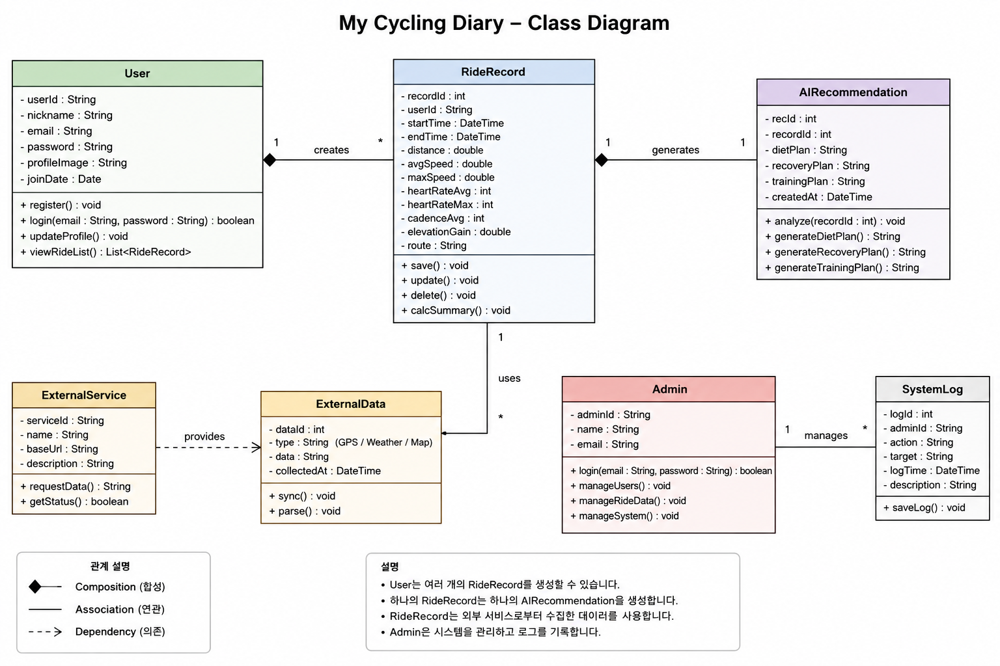
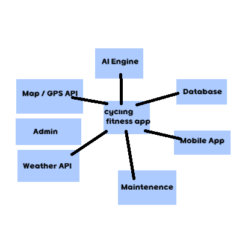
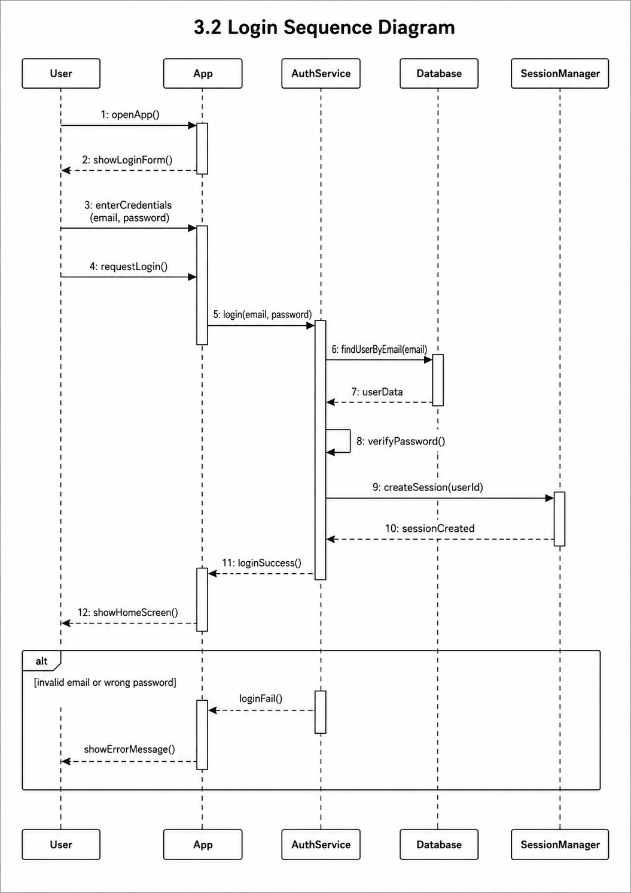
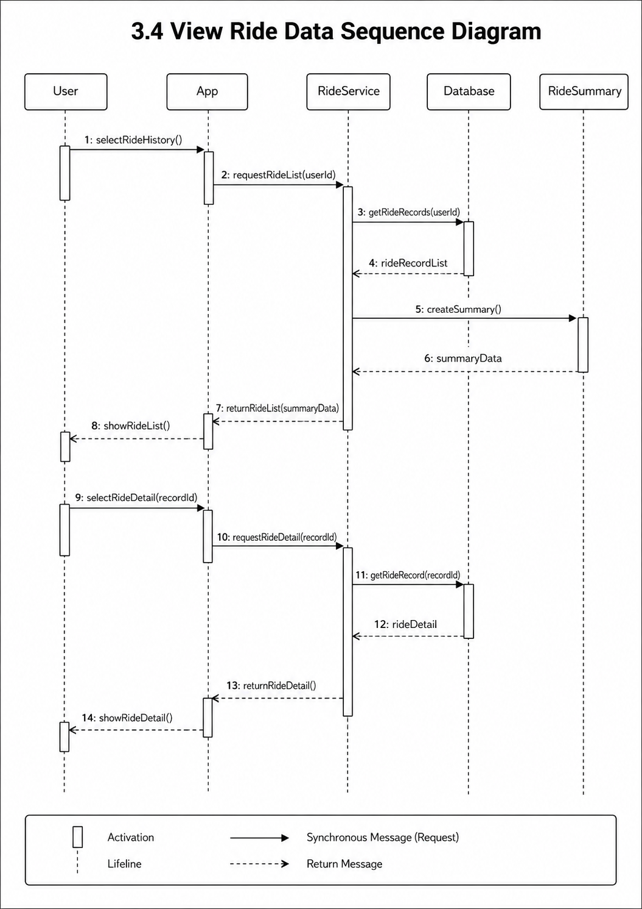
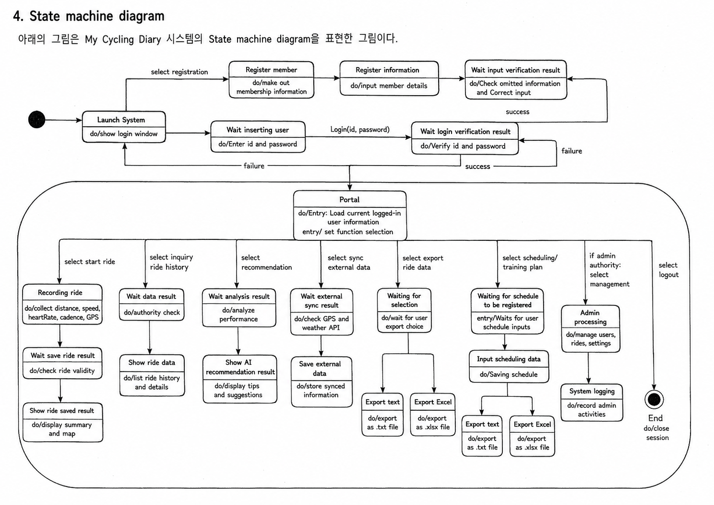

# 3. Design

## My Cycling Diary

##student information
22411956
김경훈
legodol2@naver.com

##1. Introduction

코로나19 이후 자전거를 취미와 운동으로 즐기는 인구가 크게 증가하면서 라이딩 기록을 측정하고 관리하는 서비스에 대한 수요도 함께 늘어났다. 기존에는 STRAVA와 같은 해외 서비스를 통해 거리, 속도, 심박수 등의 기록을 관리할 수 있었으나, 국내 서비스 종료와 언어 및 기능상의 제약으로 인해 한국 사용자들이 불편을 겪게 되었다. 이에 따라 한국 라이더들의 요구를 반영한 라이딩 기록 관리 시스템인 "My Cycling Diary"를 기획하게 되었다.

본 시스템은 라이딩 기록 측정뿐만 아니라 AI 기반 식단 추천, 운동 후 회복 가이드, 웨이트 트레이닝 추천, 최신 자전거 관련 정보 제공 등의 기능을 통해 사용자의 운동 성과 향상을 지원하는 것을 목표로 한다. 또한 GPS 및 외부 데이터 연동을 활용하여 보다 정확하고 체계적인 운동 기록 관리를 제공하고자 한다.

주요 대상 사용자는 로드사이클, MTB, 생활 자전거 등 다양한 형태의 자전거 활동을 즐기는 라이더들이며, 자신의 운동 데이터를 체계적으로 관리하고 기록 향상을 원하는 사용자들이다. 또한 초보자부터 숙련자까지 폭넓게 사용할 수 있는 환경을 제공하여 국내 자전거 문화 활성화에도 기여하고자 한다.

아래는 Analysis에 이어 본 시스템 개발의 세 번째 단계인 Design에 관한 내용으로서, 실제 시스템 구현에 직접적으로 관여하는 모든 요소들의 구조와 세부 사항을 구체적으로 설계하는 과정을 다루고 있다. 본 문서에서는 시스템의 기능 구성, 사용자와 시스템 간의 상호작용, 데이터 흐름, 운영 절차 등을 정의하며, 이후 구현 단계에서 활용될 설계 기준을 제시한다. 또한 본 문서에 기술된 내용은 실제 구현 과정에서 사용될 기능 및 구조와 일관성을 유지하는 것을 목표로 한다.

##2. Class diagram

아래의 표는 위의 Class Diagram에서 표현한 Class들과 My Cycling Diary 시스템 구현에 필요한 주요 Class들에 대한 설명이다.
Class Name: User
Explanation:
User 클래스는 My Cycling Diary 시스템을 사용하는 일반 사용자의 정보를 저장하고 관리하는 클래스이다.
사용자의 고유 ID, 닉네임, 이메일, 비밀번호, 프로필 이미지, 가입일 정보를 속성으로 가진다.
사용자는 앱을 처음 사용할 때 회원가입을 수행할 수 있으며, 이후 이메일과 비밀번호를 입력하여 로그인할 수 있다. 로그인에 성공한 사용자는 자신의 라이딩 기록을 생성하거나 조회할 수 있고, 프로필 정보를 수정할 수 있다. 또한 자신이 지금까지 저장한 라이딩 기록 목록을 확인할 수 있다. 하나의 User는 여러 개의 RideRecord를 생성할 수 있으므로 User 클래스는 RideRecord 클래스와 1:N 관계를 가진다. 이 클래스는 시스템에서 가장 기본이 되는 사용자 정보를 관리하며, 라이딩 기록 기능과 AI 추천 기능이 수행되기 위한 출발점 역할을 한다.
Class Name: Admin
Explanation:
Admin 클래스는 My Cycling Diary 시스템을 관리하는 관리자 정보를 저장하고 관리자 기능을 수행하는 클래스이다.
관리자 ID, 관리자 이름, 이메일 정보를 속성으로 가진다. 일반 사용자와 달리 관리자는 시스템 전체를 관리할 수 있는 권한을 가진다. 
관리자는 로그인 후 사용자 정보를 조회하거나 수정할 수 있고, 비정상적인 계정을 관리할 수 있다. 또한 사용자의 라이딩 기록 데이터 중 오류가 있거나 관리가 필요한 데이터를 확인하고 처리할 수 있다. 시스템 운영과 관련된 설정, 데이터 관리, 서비스 상태 확인 등의 기능도 수행할 수 있다. Admin 클래스는 일반 사용자 기능과 구분되는 관리자 권한을 표현하며, 시스템의 안정적인 운영과 데이터 관리를 위해 필요한 클래스이다.
Class Name: AuthService
Explanation:
AuthService 클래스는 사용자 인증과 관련된 기능을 담당하는 클래스이다. 회원가입, 로그인, 로그아웃, 비밀번호 확인, 이메일 중복 확인 등의 기능을 수행한다.
사용자가 회원가입을 요청하면 입력한 이메일이 이미 사용 중인지 확인하고, 입력된 비밀번호가 조건에 맞는지 검사한다.
사용자가 로그인을 요청하면 데이터베이스에 저장된 사용자 정보와 입력된 이메일 및 비밀번호를 비교하여 로그인 성공 여부를 판단한다.
시스템 보안을 위해 비밀번호를 암호화하여 저장하는 기능도 AuthService 클래스에서 처리할 수 있다. 이 클래스는 사용자가 시스템의 주요 기능에 접근하기 전에 등록된 사용자인지 확인하는 역할을 한다.
Class Name: UserProfile
Explanation:
UserProfile 클래스는 사용자의 세부 프로필 정보를 저장하는 클래스이다.
사용자의 키, 몸무게, 나이, 성별, 최대 심박수, 운동 목표, 라이딩 경력 등의 정보를 속성으로 가질 수 있다.
이 정보는 사용자의 운동 상태를 파악하고 개인 맞춤형 추천을 제공하는 데 사용된다. 예를 들어 같은 거리의 라이딩을 하더라도 사용자의 몸무게, 운동 경력, 목표에 따라 추천되는 식단과 회복 방법은 달라질 수 있다. 따라서 UserProfile 클래스는 AI 추천 기능의 정확도를 높이기 위한 기초 데이터 역할을 한다.
Class Name: RideRecord
Explanation:
RideRecord 클래스는 사용자가 수행한 하나의 라이딩 활동에 대한 정보를 저장하는 핵심 클래스이다. 
라이딩 기록 ID, 사용자 ID, 라이딩 시작 시간, 종료 시간, 주행 거리, 평균 속도, 최고 속도, 평균 심박수, 최대 심박수, 평균 케이던스, 고도 상승량, 이동 경로 정보를 속성으로 가진다. 사용자가 라이딩을 시작하면 시스템은 시간, 위치, 속도 등의 데이터를 수집하고, 라이딩 종료 후 하나의 RideRecord 객체로 저장한다. 저장된 RideRecord는 이후 기록 조회, 성과 분석, AI 추천 기능의 기본 데이터로 사용된다. 이 클래스는 사용자의 운동 기록을 직접적으로 저장하는 가장 중요한 데이터 클래스이다.
Class Name: RideSummary
Explanation:
RideSummary 클래스는 라이딩 기록을 요약한 정보를 저장하는 클래스이다.
전체 주행 거리, 총 운동 시간, 평균 속도, 최고 속도, 평균 심박수, 칼로리 소모량, PR 달성 여부 등을 속성으로 가질 수 있다.
RideRecord 클래스가 라이딩의 상세한 원본 데이터를 저장한다면, RideSummary 클래스는 사용자가 쉽게 이해할 수 있도록 핵심 정보를 요약하여 제공한다. 
사용자는 RideSummary를 통해 자신의 라이딩 성과를 빠르게 확인할 수 있고, 이전 기록과 비교하여 운동 성과가 향상되었는지 판단할 수 있다.
Class Name: GPSData
Explanation:
GPSData 클래스는 라이딩 중 수집되는 위치 정보를 저장하는 클래스이다. 위도, 경도, 고도, 측정 시간 등의 정보를 속성으로 가진다.
여러 개의 GPSData가 모이면 사용자의 전체 라이딩 경로를 구성할 수 있다. 이 데이터는 주행 거리 계산, 경로 지도 표시, 속도 계산 등에 사용된다.
GPSData 클래스는 라이딩 기록의 정확도를 높이는 데 중요한 역할을 하며, 사용자가 어떤 경로로 이동했는지 시각적으로 확인할 수 있도록 돕는다.
Class Name: WeatherData
Explanation:
WeatherData 클래스는 라이딩 당시의 날씨 정보를 저장하는 클래스이다. 기온, 습도, 풍속, 날씨 상태, 강수 여부 등의 정보를 속성으로 가진다. 
자전거 라이딩 성과는 날씨의 영향을 많이 받을 수 있기 때문에, WeatherData는 라이딩 기록을 분석할 때 보조 자료로 사용된다. 
예를 들어 같은 코스를 달렸더라도 바람이 강한 날에는 평균 속도가 낮아질 수 있다. 따라서 WeatherData 클래스는 사용자의 기록을 더 정확하게 해석하는 데 도움을 준다.
Class Name: ExternalService
Explanation:
ExternalService 클래스는 My Cycling Diary 시스템이 사용하는 외부 서비스를 표현하는 클래스이다.
GPS, 날씨, 지도 서비스와 같은 외부 API의 서비스 ID, 서비스 이름, 기본 URL, 서비스 설명 정보를 속성으로 가진다.
사용자가 라이딩을 시작하면 시스템은 ExternalService를 통해 위치 정보, 날씨 정보, 지도 정보를 요청할 수 있다.
또한 외부 서비스가 정상적으로 작동하는지 확인하는 기능도 수행한다. 만약 외부 API에 오류가 발생하거나 연결이 불안정하다면 시스템은 해당 상태를 확인하고 사용자에게 오류 메시지를 제공할 수 있다.
Class Name: ExternalData
Explanation:
ExternalData 클래스는 ExternalService를 통해 수집된 외부 데이터를 저장하고 처리하는 클래스이다.
데이터 ID, 데이터 종류, 실제 데이터 값, 데이터 수집 시간을 속성으로 가진다. 
데이터 종류는 GPS, Weather, Map 등이 될 수 있으며, 라이딩 기록의 정확도를 높이기 위해 사용된다.
외부 API에서 가져온 데이터는 시스템에서 바로 사용하기 어려울 수 있으므로, ExternalData 클래스는 데이터를 동기화하고 필요한 형태로 변환하는 역할을 한다. 
이 클래스는 RideRecord와 연결되어 라이딩 기록을 실제 환경 정보가 반영된 데이터로 만들어 준다.
Class Name: MapService
Explanation:
MapService 클래스는 사용자의 라이딩 경로를 지도 위에 표시하는 기능을 담당하는 클래스이다.
GPSData를 바탕으로 이동 경로를 시각화하고, 시작 지점과 종료 지점, 이동 거리 등을 지도에 표시한다. 
사용자는 MapService를 통해 자신이 어떤 코스를 달렸는지 확인할 수 있으며, 자주 이용하는 코스나 기록이 좋은 코스를 비교할 수 있다. 
이 클래스는 라이딩 기록을 단순한 숫자 데이터가 아니라 시각적인 경로 정보로 보여주는 역할을 한다.
Class Name: PerformanceAnalyzer
Explanation:
PerformanceAnalyzer 클래스는 사용자의 라이딩 데이터를 분석하는 클래스이다. 
거리, 평균 속도, 최고 속도, 심박수, 케이던스, 고도 상승량 등의 데이터를 바탕으로 사용자의 운동 성과를 분석한다. 
이전 라이딩 기록과 비교하여 기록이 향상되었는지, 운동 강도가 높았는지, 피로도가 어느 정도였는지 판단할 수 있다. 
또한 분석 결과는 AIRecommendation 또는 RecommendationService에서 식단, 회복, 훈련 계획을 추천하는 데 활용된다. 
PerformanceAnalyzer 클래스는 단순히 데이터를 저장하는 것을 넘어 사용자의 운동 상태를 해석하는 역할을 한다.

Class Name: ErrorHandler
Explanation:
ErrorHandler 클래스는 시스템 사용 중 발생하는 오류를 처리하는 클래스이다.
로그인 실패, 외부 API 연결 실패, 데이터 저장 실패, 권한 오류, 잘못된 입력값 등의 상황이 발생했을 때 적절한 오류 메시지를 생성한다.
사용자는 오류 메시지를 통해 어떤 문제가 발생했는지 이해하고 다시 시도할 수 있다. ErrorHandler 클래스는 시스템의 안정성과 사용 편의성을 높이는 데 필요한 클래스이다.
Class Name: SecurityManager
Explanation:
SecurityManager 클래스는 시스템 보안과 관련된 기능을 담당하는 클래스이다.
비밀번호 암호화, 로그인 세션 관리, 사용자 권한 확인, 개인정보 보호 기능을 수행한다.
라이딩 기록에는 사용자의 위치 정보와 운동 데이터가 포함될 수 있기 때문에 보안 처리가 중요하다.
SecurityManager 클래스는 사용자의 개인정보가 외부로 유출되지 않도록 보호하고, 권한이 없는 사용자가 민감한 정보에 접근하지 못하도록 한다.
Class Name: SessionManager
Explanation:
SessionManager 클래스는 로그인한 사용자의 접속 상태를 관리하는 클래스이다.
사용자가 로그인하면 세션을 생성하고, 로그아웃하면 세션을 종료한다. 현재 로그인한 사용자가 누구인지 확인하고,
사용자가 특정 기능에 접근할 수 있는 권한이 있는지 판단하는 데 사용된다. SessionManager 클래스는 로그인 상태 유지와 사용자 인증 흐름을 관리하는 역할을 한다.
Class Name: FileManager
Explanation:
FileManager 클래스는 이미지, 경로 파일, 백업 파일 등 시스템에서 사용하는 파일을 관리하는 클래스이다.
사용자의 프로필 이미지 저장, 라이딩 경로 파일 저장, 데이터 백업 파일 생성 등의 기능을 수행할 수 있다.
예를 들어 사용자가 프로필 이미지를 등록하면 FileManager가 해당 파일을 저장하고 관리한다.
또한 라이딩 경로 데이터를 파일 형태로 저장하거나 내보낼 때도 사용될 수 있다.
Class Name: BackupManager
Explanation:
BackupManager 클래스는 시스템 데이터의 백업과 복구를 담당하는 클래스이다. 
사용자 정보, 라이딩 기록, 추천 결과, 시스템 로그를 주기적으로 백업하여 데이터 손실을 방지한다.
서버 오류나 데이터베이스 문제가 발생했을 때 백업 데이터를 이용하여 복구할 수 있다.
BackupManager 클래스는 시스템을 안정적으로 운영하기 위해 필요한 관리 기능을 담당한다.

##3. Sequence diagram

##4. State machine diagram

아래의 표는 위의 State machine diagram에서 표현한 주요 State들에 대한 설명이다.
State Name: Start
Explanation:
Start 상태는 My Cycling Diary 시스템의 초기 상태를 의미한다. 사용자가 앱을 실행하기 전 또는 시스템이 아직 동작을 시작하지 않은 상태이다. 사용자가 앱을 실행하면 시스템은 Launch System 상태로 이동한다. State machine diagram에서는 검은색 원으로 표현된다.
State Name: Launch System
Explanation:
Launch System 상태는 사용자가 My Cycling Diary 앱을 실행한 직후의 상태이다. 이 상태에서는 시스템이 앱 실행에 필요한 기본 정보를 불러오고 로그인 화면을 출력한다. 사용자는 이 상태 이후 로그인하거나 회원가입을 선택할 수 있다. 시스템은 기본적으로 로그인 화면을 보여주며, 사용자의 다음 입력을 기다린다.
State Name: Register member
Explanation:
Register member 상태는 사용자가 회원가입을 선택했을 때 이동하는 상태이다. 사용자가 아직 계정이 없는 경우 이 상태에서 회원 정보를 입력할 수 있다. 시스템은 사용자에게 닉네임, 이메일, 비밀번호, 프로필 정보 등을 입력할 수 있는 회원가입 화면을 제공한다. 이 상태는 새로운 사용자를 등록하기 위한 첫 번째 단계이다.
State Name: Register information
Explanation:
Register information 상태는 사용자가 회원가입 화면에서 실제 회원 정보를 입력하는 상태이다. 사용자는 닉네임, 이메일, 비밀번호, 프로필 정보 등을 입력한다. 입력된 정보는 이후 시스템에서 검증 과정을 거치게 된다. 이 상태에서 입력된 정보가 올바르면 회원가입 검증 상태로 이동하고, 정보가 부족하거나 형식이 맞지 않으면 다시 입력을 요구할 수 있다.
State Name: Wait input verification result
Explanation:
Wait input verification result 상태는 사용자가 입력한 회원가입 정보가 올바른지 시스템이 확인하는 상태이다. 시스템은 이메일 중복 여부, 비밀번호 형식, 필수 입력값 누락 여부 등을 검사한다. 입력값이 올바르면 회원가입이 완료되고 로그인 화면으로 이동한다. 반대로 입력값이 잘못되었거나 이미 사용 중인 이메일이 있으면 다시 회원가입 정보를 입력하도록 한다.
State Name: Wait inserting user
Explanation:
Wait inserting user 상태는 사용자가 로그인 화면에서 이메일과 비밀번호를 입력하는 상태이다. 사용자는 등록된 계정을 이용하여 시스템에 접속하기 위해 로그인 정보를 입력한다. 이 상태에서 입력된 이메일과 비밀번호는 로그인 검증 상태로 전달된다. 사용자가 잘못된 정보를 입력하면 로그인 실패 상태가 발생할 수 있다.
State Name: Wait login verification result
Explanation:
Wait login verification result 상태는 사용자가 입력한 로그인 정보가 올바른지 시스템이 확인하는 상태이다. 시스템은 데이터베이스에 저장된 사용자 정보와 입력된 이메일 및 비밀번호를 비교한다. 로그인 정보가 일치하면 Portal 상태로 이동한다. 로그인 정보가 일치하지 않으면 실패 결과를 반환하고 다시 로그인 화면으로 돌아간다.
State Name: Portal
Explanation:
Portal 상태는 사용자가 로그인에 성공한 후 도달하는 중심 상태이다. 이 상태는 My Cycling Diary 시스템의 Home 화면에 해당한다. 사용자는 Portal 상태에서 라이딩 기록 시작, 기록 조회, AI 추천 보기, 외부 데이터 연동, 기록 내보내기, 스케줄 또는 훈련 계획 등록, 관리자 기능, 로그아웃 등을 선택할 수 있다. 대부분의 주요 기능은 Portal 상태에서 시작된다.
State Name: Recording ride
Explanation:
Recording ride 상태는 사용자가 라이딩 시작 기능을 선택했을 때 이동하는 상태이다. 이 상태에서 시스템은 라이딩 중 발생하는 거리, 속도, 심박수, 케이던스, GPS 위치 정보를 수집한다. 사용자가 라이딩을 계속하는 동안 시스템은 데이터를 지속적으로 저장하거나 임시 기록한다. 라이딩이 종료되면 Wait save ride result 상태로 이동한다.
State Name: Wait save ride result
Explanation:
Wait save ride result 상태는 라이딩 종료 후 수집된 데이터가 저장 가능한지 확인하는 상태이다. 시스템은 라이딩 거리, 시간, GPS 정보, 심박수, 케이던스 등의 데이터가 정상적으로 수집되었는지 확인한다. 데이터가 올바르면 라이딩 기록을 저장하고 Show ride saved result 상태로 이동한다. 데이터가 부족하거나 오류가 있으면 저장 실패 메시지를 출력할 수 있다.
State Name: Show ride saved result
Explanation:
Show ride saved result 상태는 라이딩 기록 저장이 완료된 후 사용자에게 결과를 보여주는 상태이다. 시스템은 사용자의 라이딩 요약 정보, 이동 경로, 평균 속도, 최고 속도, 심박수, 케이던스 등을 화면에 출력한다. 사용자는 이 상태에서 자신의 라이딩 결과를 확인한 후 다시 Portal 상태로 돌아가 다른 기능을 사용할 수 있다.
State Name: Wait data result
Explanation:
Wait data result 상태는 사용자가 라이딩 기록 조회 기능을 선택했을 때 시스템이 데이터를 불러오는 상태이다. 시스템은 현재 로그인한 사용자의 권한과 사용자 ID를 확인한 뒤 데이터베이스에서 해당 사용자의 라이딩 기록을 조회한다. 조회가 완료되면 Show ride data 상태로 이동한다.
State Name: Show ride data
Explanation:
Show ride data 상태는 사용자의 라이딩 기록을 화면에 출력하는 상태이다. 이 상태에서는 날짜별 라이딩 기록, 거리, 평균 속도, 최고 속도, 운동 시간, 심박수, 케이던스 등의 정보를 확인할 수 있다. 사용자는 특정 라이딩 기록을 선택하여 상세 정보를 볼 수도 있다. 기록 확인이 끝나면 다시 Portal 상태로 돌아갈 수 있다.
State Name: Wait analysis result
Explanation:
Wait analysis result 상태는 사용자가 AI 추천 또는 성과 분석 기능을 선택했을 때 시스템이 라이딩 기록을 분석하는 상태이다. 시스템은 사용자의 최근 라이딩 기록, 과거 기록, 프로필 정보 등을 바탕으로 운동 성과를 분석한다. 분석 대상에는 평균 속도, 심박수, 케이던스, 고도 상승량, 피로도, 기록 향상 여부 등이 포함된다.
State Name: Show AI recommendation result
Explanation:
Show AI recommendation result 상태는 분석 결과를 바탕으로 생성된 AI 추천 결과를 사용자에게 보여주는 상태이다. 이 상태에서 사용자는 식단 추천, 회복 방법, 웨이트 트레이닝 계획, 다음 운동 방향 등을 확인할 수 있다. AI 추천 결과는 사용자의 라이딩 기록과 프로필 정보를 기반으로 생성된다. 추천 결과 확인 후 사용자는 다시 Portal 상태로 돌아갈 수 있다.
State Name: Wait external sync result
Explanation:
Wait external sync result 상태는 시스템이 외부 데이터를 연동하는 상태이다. My Cycling Diary 시스템은 GPS API, Weather API와 같은 외부 서비스를 사용하여 위치 정보와 날씨 정보를 가져온다. 이 상태에서는 외부 서비스와의 연결 상태를 확인하고 필요한 데이터를 요청한다. 외부 데이터가 정상적으로 수집되면 Save external data 상태로 이동한다.
State Name: Save external data
Explanation:
Save external data 상태는 외부 서비스에서 수집한 GPS 정보와 날씨 정보를 시스템에 저장하는 상태이다. 수집된 데이터는 사용자의 라이딩 기록과 연결되어 기록의 정확도를 높인다. 예를 들어 GPS 데이터는 이동 경로와 거리 계산에 사용되고, 날씨 데이터는 라이딩 당시의 환경을 기록하는 데 사용된다. 저장이 완료되면 다시 Portal 상태로 이동할 수 있다.
State Name: Waiting for selection
Explanation:
Waiting for selection 상태는 사용자가 라이딩 데이터를 내보내기 위해 파일 형식을 선택하는 상태이다. 사용자는 텍스트 파일 또는 엑셀 파일 형식 중 하나를 선택할 수 있다. 선택된 형식에 따라 Export text 또는 Export Excel 상태로 이동한다.
State Name: Export text
Explanation:
Export text 상태는 사용자의 라이딩 기록을 텍스트 파일 형식으로 내보내는 상태이다. 시스템은 저장된 라이딩 데이터를 정리하여 .txt 파일로 생성한다. 사용자는 이 파일을 통해 자신의 기록을 따로 보관하거나 다른 곳에 공유할 수 있다.
State Name: Export Excel
Explanation:
Export Excel 상태는 사용자의 라이딩 기록을 엑셀 파일 형식으로 내보내는 상태이다. 시스템은 주행 거리, 속도, 심박수, 케이던스, 날짜 등의 데이터를 표 형태로 정리하여 .xlsx 파일로 생성한다. 이 기능은 사용자가 자신의 기록을 체계적으로 분석하거나 관리할 때 유용하다.
State Name: Waiting for schedule to be registered
Explanation:
Waiting for schedule to be registered 상태는 사용자가 훈련 계획이나 라이딩 일정을 등록하기 위해 입력을 준비하는 상태이다. 사용자는 운동 날짜, 목표 거리, 목표 시간, 훈련 종류 등을 입력할 수 있다. 입력이 완료되면 Input scheduling data 상태로 이동한다.
State Name: Input scheduling data
Explanation:
Input scheduling data 상태는 사용자가 실제 훈련 일정이나 운동 계획을 입력하는 상태이다. 시스템은 사용자가 입력한 일정을 저장하고 이후 알림이나 훈련 계획 기능과 연결할 수 있다. 이 상태를 통해 사용자는 단순히 과거 기록만 확인하는 것이 아니라 앞으로의 운동 계획도 관리할 수 있다.
State Name: Admin processing
Explanation:
Admin processing 상태는 관리자 권한을 가진 사용자가 시스템 관리 기능을 선택했을 때 이동하는 상태이다. 관리자는 사용자 정보, 라이딩 기록, 시스템 설정, 외부 데이터 상태 등을 관리할 수 있다. 일반 사용자는 이 상태에 접근할 수 없으며, 관리자 권한이 확인된 경우에만 실행된다.
State Name: System logging
Explanation:
System logging 상태는 관리자가 수행한 작업을 로그로 기록하는 상태이다. 관리자가 사용자 정보를 수정하거나, 데이터를 삭제하거나, 시스템 설정을 변경하면 해당 작업 내용이 로그로 저장된다. 이 상태는 시스템 운영의 투명성을 높이고, 문제가 발생했을 때 원인을 추적하는 데 도움을 준다.
State Name: End
Explanation:
End 상태는 시스템 사용이 종료된 상태를 의미한다. 사용자가 Portal 상태에서 로그아웃을 선택하면 현재 세션이 종료되고 End 상태로 이동한다. State machine diagram에서는 검은색 원 안에 흰색 원이 있는 종료 상태 기호로 표현된다.
State Name: Failure
Explanation:
Failure 상태는 로그인 실패, 회원가입 실패, 외부 데이터 연동 실패, 데이터 저장 실패 등 시스템 사용 중 오류가 발생했을 때 나타나는 상태이다. 실패가 발생하면 시스템은 사용자에게 오류 메시지를 보여주고, 다시 이전 상태나 로그인 화면으로 이동할 수 있도록 한다.
State Name: Success
Explanation:
Success 상태는 사용자의 요청이 정상적으로 처리되었을 때 나타나는 결과 상태이다. 예를 들어 회원가입 성공, 로그인 성공, 라이딩 기록 저장 성공, 외부 데이터 저장 성공, 관리자 작업 완료 등이 이에 해당한다. 성공 결과가 발생하면 시스템은 다음 기능으로 이동하거나 Portal 상태로 돌아간다.
위의 State machine diagram은 My Cycling Diary 시스템의 전체적인 상태 변화를 보여준다. 사용자는 앱 실행 후 로그인 또는 회원가입을 통해 시스템에 접근하고, 로그인에 성공하면 Portal 상태에서 다양한 기능을 선택할 수 있다. 라이딩 기록, 기록 조회, AI 추천, 외부 데이터 연동, 데이터 내보내기, 훈련 일정 등록, 관리자 기능은 모두 Portal 상태에서 시작된다. 각 기능은 처리 결과에 따라 성공 또는 실패 상태로 이동하며, 작업이 끝난 후 다시 Portal 상태로 돌아갈 수 있다. 사용자가 로그아웃을 선택하면 시스템은 End 상태로 이동하여 사용을 종료한다.

5. Implementation requirements

- Describe operating environments to implement your system.
- 12pt, 160%.

아래의 표는 My Cycling Diary 시스템을 구현하기 위해 필요한 운영 환경과 구현 요구사항을 정리한 것이다.
Requirement Name: Operating System
Explanation:
My Cycling Diary 시스템은 모바일 앱을 중심으로 사용되는 시스템이므로 Android 또는 iOS 환경에서 실행될 수 있어야 한다. 사용자는 스마트폰을 이용하여 라이딩 기록, 기록 조회, AI 추천 기능을 사용할 수 있다. 관리자 기능은 모바일 앱뿐만 아니라 웹 브라우저 환경에서도 사용할 수 있도록 구현할 수 있다. 따라서 Windows, macOS, Android, iOS 등 다양한 운영체제에서 접근 가능한 구조를 고려해야 한다.
Requirement Name: Client Environment
Explanation:
Client는 사용자가 직접 조작하는 모바일 앱 또는 웹 화면을 의미한다. 사용자는 Client를 통해 회원가입, 로그인, 라이딩 시작, 라이딩 종료, 기록 조회, AI 추천 결과 확인 등의 기능을 수행한다. Client는 사용자가 쉽게 이해할 수 있는 직관적인 화면으로 구성되어야 하며, 라이딩 중에도 빠르게 조작할 수 있어야 한다. 특히 라이딩 시작과 종료 버튼은 사용자가 쉽게 찾을 수 있도록 배치해야 한다.
Requirement Name: Server Environment
Explanation:
Server는 Client의 요청을 처리하고 필요한 데이터를 저장하거나 분석하는 역할을 한다. 사용자가 로그인하거나 라이딩 기록을 저장할 때 Server는 사용자 인증, 데이터 저장, 기록 조회, 분석 요청 처리 등을 수행한다. 또한 AI 추천 기능을 제공하기 위해 라이딩 기록과 사용자 프로필 정보를 분석할 수 있어야 한다. 안정적인 서비스 제공을 위해 Server는 여러 사용자의 요청을 동시에 처리할 수 있어야 한다.
Requirement Name: Database
Explanation:
Database는 My Cycling Diary 시스템에서 사용하는 모든 데이터를 저장하는 공간이다. 사용자 정보, 라이딩 기록, GPS 데이터, 날씨 데이터, AI 추천 결과, 관리자 로그 등이 Database에 저장된다. 사용자가 자신의 라이딩 기록을 조회할 때 Database에서 해당 데이터를 불러오며, AI 추천을 생성할 때도 기존 기록이 사용된다. 데이터의 손실을 막기 위해 정기적인 백업과 안정적인 저장 구조가 필요하다.
Requirement Name: Network
Explanation:
My Cycling Diary 시스템은 GPS, 날씨 API, 지도 서비스와 같은 외부 기능을 사용하므로 인터넷 연결이 필요하다. 사용자가 라이딩 중일 때 위치 데이터와 날씨 데이터를 수집해야 하며, 라이딩 종료 후 기록을 Server에 저장하기 위해 네트워크 연결이 필요하다. 네트워크 연결이 불안정한 경우를 대비해 임시 저장 기능을 구현할 필요가 있다. 사용자가 오프라인 상태에서 라이딩을 기록한 경우, 네트워크가 연결되었을 때 자동으로 데이터를 동기화할 수 있어야 한다.
Requirement Name: External API
Explanation:
시스템은 라이딩 기록의 정확도를 높이기 위해 외부 API를 사용할 수 있다. GPS API는 사용자의 위치, 이동 경로, 고도 정보를 수집하는 데 사용된다. Weather API는 라이딩 당시의 기온, 습도, 풍속, 날씨 상태 등을 가져오는 데 사용된다. Map API는 사용자의 이동 경로를 지도에 표시하는 데 사용될 수 있다. 외부 API는 시스템의 중요한 기능과 연결되므로 API 오류나 응답 지연이 발생했을 때 예외 처리가 필요하다.
Requirement Name: AI Module
Explanation:
AI Module은 사용자의 라이딩 기록과 프로필 정보를 분석하여 개인 맞춤형 추천을 제공하는 기능이다. AI Module은 거리, 평균 속도, 심박수, 케이던스, 고도 상승량, 운동 시간 등의 데이터를 분석하고, 이를 바탕으로 식단, 회복, 훈련 계획을 추천한다. 사용자의 데이터가 부족할 경우 추천 정확도가 낮아질 수 있으므로 기본 추천 규칙을 함께 제공할 필요가 있다. AI 추천 결과는 사용자가 이해하기 쉬운 문장과 항목으로 제시되어야 한다.
Requirement Name: Performance
Explanation:
시스템은 사용자의 요청에 빠르게 응답해야 한다. 라이딩 중에는 위치, 속도, 심박수 등의 데이터가 지속적으로 수집되므로 데이터 처리 속도가 중요하다. 기록 조회나 AI 추천 결과 출력도 사용자가 오래 기다리지 않도록 빠르게 처리되어야 한다. 특히 라이딩 중 데이터 수집이 지연되면 기록의 정확도가 떨어질 수 있으므로 실시간 처리 성능을 고려해야 한다.
Requirement Name: Security
Explanation:
My Cycling Diary 시스템은 사용자의 개인정보와 운동 데이터를 저장하므로 보안이 중요하다. 사용자의 이메일, 비밀번호, 위치 정보, 라이딩 기록 등은 외부로 유출되지 않도록 보호되어야 한다. 비밀번호는 암호화하여 저장해야 하며, 로그인한 사용자만 자신의 기록을 조회할 수 있도록 권한 검사를 수행해야 한다. 관리자 기능은 일반 사용자가 접근할 수 없도록 별도의 권한 확인 절차가 필요하다.
Requirement Name: Availability
Explanation:
Availability는 사용자가 필요할 때 언제든지 시스템을 사용할 수 있는 정도를 의미한다. 사용자는 라이딩 전, 라이딩 중, 라이딩 후에 앱을 사용할 수 있어야 하므로 시스템은 안정적으로 동작해야 한다. 서버 장애나 외부 API 오류가 발생하더라도 앱의 기본적인 기록 기능은 가능한 한 유지되어야 한다. 이를 위해 임시 저장, 재시도, 백업 기능을 고려할 수 있다.
Requirement Name: Scalability
Explanation:
Scalability는 사용자가 증가했을 때 시스템이 확장될 수 있는 능력을 의미한다. My Cycling Diary 시스템의 사용자가 많아지면 라이딩 기록, GPS 데이터, AI 추천 결과가 많이 저장된다. 따라서 서버와 데이터베이스는 사용자 수와 데이터 양이 증가해도 안정적으로 처리할 수 있도록 설계되어야 한다. 필요할 경우 서버 자원을 확장하거나 데이터베이스 구조를 최적화할 수 있어야 한다.
Requirement Name: Usability
Explanation:
Usability는 사용자가 시스템을 얼마나 쉽고 편리하게 사용할 수 있는지를 의미한다. My Cycling Diary는 자전거 라이딩 중에도 사용될 수 있으므로 화면 구성이 단순하고 직관적이어야 한다. 라이딩 시작, 종료, 기록 저장, 기록 조회 기능은 사용자가 빠르게 찾을 수 있어야 한다. 또한 AI 추천 결과는 복잡한 전문 용어보다 사용자가 바로 이해할 수 있는 표현으로 제공되어야 한다.
Requirement Name: Reliability
Explanation:
Reliability는 시스템이 오류 없이 안정적으로 동작하는 정도를 의미한다. 라이딩 중 앱이 종료되거나 데이터 저장에 실패하면 사용자의 중요한 운동 기록이 손실될 수 있다. 따라서 시스템은 라이딩 데이터를 주기적으로 임시 저장하고, 오류가 발생해도 최대한 데이터를 복구할 수 있도록 설계되어야 한다. 또한 저장된 데이터가 잘못 변경되거나 손상되지 않도록 관리해야 한다.
Requirement Name: Maintainability
Explanation:
Maintainability는 시스템을 수정하고 관리하기 쉬운 정도를 의미한다. My Cycling Diary 시스템은 라이딩 기록, AI 추천, 외부 API 연동, 관리자 기능 등 여러 기능으로 구성되므로 각 기능을 독립적인 모듈로 나누어 구현하는 것이 좋다. 기능별로 클래스를 분리하면 나중에 오류를 수정하거나 새로운 기능을 추가하기 쉽다. 예를 들어 GPS API가 변경되더라도 ExternalService 클래스만 수정하면 되도록 설계할 수 있다.
Requirement Name: Portability
Explanation:
Portability는 시스템이 다양한 환경에서 실행될 수 있는 능력을 의미한다. My Cycling Diary는 Android와 iOS에서 모두 사용할 수 있는 모바일 앱으로 구현될 수 있으며, 관리자 기능은 웹 환경에서도 사용할 수 있도록 설계할 수 있다. 다양한 기기에서 화면 크기와 운영체제가 달라도 기능이 정상적으로 작동해야 한다.
Requirement Name: Data Backup
Explanation:
Data Backup은 데이터 손실을 방지하기 위한 요구사항이다. 사용자 정보, 라이딩 기록, AI 추천 결과, 관리자 로그는 중요한 데이터이므로 정기적으로 백업해야 한다. 서버 오류, 데이터베이스 손상, 사용자 실수로 인한 데이터 삭제가 발생할 경우 백업 데이터를 이용하여 복구할 수 있어야 한다. 관리자는 필요할 경우 백업 파일을 생성하거나 복원할 수 있어야 한다.
Requirement Name: Error Handling
Explanation:
Error Handling은 시스템 사용 중 발생하는 오류를 처리하는 요구사항이다. 로그인 실패, 회원가입 실패, GPS 연결 실패, 날씨 API 오류, 데이터 저장 실패, 네트워크 연결 실패 등이 발생할 수 있다. 이러한 오류가 발생했을 때 시스템은 사용자에게 이해하기 쉬운 오류 메시지를 제공해야 한다. 또한 오류가 발생하더라도 앱 전체가 종료되지 않고 사용자가 다시 시도할 수 있도록 해야 한다.
Requirement Name: Privacy
Explanation:
Privacy는 사용자의 개인정보와 위치 정보를 보호하는 요구사항이다. My Cycling Diary 시스템은 사용자의 이메일, 프로필 정보, 라이딩 경로, 위치 정보, 운동 기록을 다룬다. 특히 GPS 기반 위치 정보는 민감한 정보이므로 사용자의 동의 없이 외부에 공개되어서는 안 된다. 사용자는 자신의 기록 공개 여부를 선택할 수 있어야 하며, 시스템은 개인정보 보호 정책에 따라 데이터를 관리해야 한다.
Requirement Name: Storage Capacity
Explanation:
Storage Capacity는 시스템이 충분한 양의 데이터를 저장할 수 있어야 한다는 요구사항이다. 라이딩 기록은 시간이 지날수록 누적되며, GPS 경로 데이터와 날씨 데이터도 함께 저장될 수 있다. 사용자가 많아질수록 데이터 저장량은 급격히 증가할 수 있으므로 충분한 저장 공간과 효율적인 데이터 관리 방식이 필요하다. 오래된 데이터는 압축하거나 백업 저장소로 이동하는 방식도 고려할 수 있다.
Requirement Name: Compatibility
Explanation:
Compatibility는 시스템이 다양한 외부 장치나 서비스와 호환될 수 있어야 한다는 요구사항이다. 사용자는 스마트폰뿐만 아니라 스마트워치, 심박계, 케이던스 센서, 자전거 컴퓨터 등의 장치를 사용할 수 있다. 시스템은 이러한 외부 장치와 연동될 수 있도록 확장성을 고려해야 한다. 또한 GPS API, Weather API, Map API와 같은 외부 서비스와도 안정적으로 호환되어야 한다.
Requirement Name: User Interface
Explanation:
User Interface는 사용자가 시스템과 상호작용하는 화면을 의미한다. My Cycling Diary의 UI는 라이딩 기록 앱의 특성상 간단하고 명확해야 한다. 사용자는 운동 중 복잡한 조작을 하기 어렵기 때문에 주요 버튼과 정보는 한눈에 보이도록 구성해야 한다. 라이딩 중 화면에는 현재 속도, 거리, 시간, 심박수 등 핵심 정보가 우선적으로 표시되어야 한다.
Requirement Name: Administrator Function
Explanation:
Administrator Function은 시스템 관리자가 사용할 수 있는 기능에 대한 요구사항이다. 관리자는 사용자 정보 조회, 사용자 계정 관리, 라이딩 기록 관리, 시스템 로그 확인, 데이터 백업, 오류 확인 등의 기능을 사용할 수 있어야 한다. 관리자 기능은 일반 사용자와 구분되어야 하며, 관리자 권한이 없는 사용자는 접근할 수 없도록 해야 한다.
Requirement Name: Logging
Explanation:
Logging은 시스템에서 발생하는 주요 작업을 기록하는 요구사항이다. 사용자의 로그인 기록, 라이딩 기록 저장, AI 추천 생성, 관리자 작업, 오류 발생 내용 등을 로그로 남길 수 있다. 로그는 시스템 오류를 추적하거나 보안 문제를 확인하는 데 사용된다. 특히 관리자 작업은 SystemLog에 저장하여 어떤 관리자가 어떤 작업을 수행했는지 확인할 수 있어야 한다.
Requirement Name: Data Export
Explanation:
Data Export는 사용자가 자신의 라이딩 기록을 외부 파일로 내보낼 수 있도록 하는 요구사항이다. 사용자는 자신의 라이딩 기록을 텍스트 파일이나 엑셀 파일 형식으로 저장할 수 있다. 이 기능은 사용자가 기록을 따로 보관하거나, 개인적으로 분석하거나, 다른 프로그램에서 활용할 때 유용하다. Export 기능은 사용자가 선택한 기간이나 특정 라이딩 기록만 내보낼 수 있도록 구현할 수 있다.

##6. Glossary
아래의 표는 My Cycling Diary 시스템 문서에서 사용된 주요 용어들을 설명한 것이다. 본 Glossary는 시스템의 기능, 설계, 구현 요구사항을 이해하는 데 필요한 용어들을 정리한 것이다.
Term: My Cycling Diary
Explanation:
My Cycling Diary는 사용자의 자전거 라이딩 기록을 저장하고 분석하는 시스템의 이름이다. 사용자는 이 시스템을 통해 자신의 라이딩 거리, 속도, 심박수, 케이던스, 이동 경로 등을 기록할 수 있다. 또한 저장된 기록을 바탕으로 운동 성과를 분석하고, AI 추천 기능을 통해 식단, 회복, 훈련 계획을 제공받을 수 있다. 단순한 기록 저장 앱이 아니라 사용자의 라이딩 퍼포먼스 향상을 돕는 개인 맞춤형 운동 관리 시스템이다.
Term: User
Explanation:
User는 My Cycling Diary 시스템을 사용하는 일반 사용자를 의미한다. 사용자는 회원가입과 로그인을 통해 시스템에 접속할 수 있으며, 라이딩 기록 생성, 기록 조회, AI 추천 결과 확인, 프로필 수정 등의 기능을 사용할 수 있다. User는 시스템에서 가장 기본적인 Actor이며, 대부분의 기능은 User의 요청으로 시작된다.
Term: Admin
Explanation:
Admin은 My Cycling Diary 시스템을 관리하는 관리자를 의미한다. Admin은 일반 사용자보다 높은 권한을 가지며, 사용자 정보 관리, 라이딩 데이터 관리, 시스템 설정 관리, 로그 확인, 데이터 백업 등의 기능을 수행할 수 있다. 관리자 기능은 시스템의 안정적인 운영을 위해 필요하며, 일반 사용자는 접근할 수 없도록 권한 검사가 필요하다.
Term: Register
Explanation:
Register는 사용자가 My Cycling Diary 시스템에 새 계정을 생성하는 과정을 의미한다. 사용자는 닉네임, 이메일, 비밀번호, 프로필 정보 등을 입력하여 회원가입을 수행한다. 시스템은 입력된 정보가 올바른지 확인하고, 이메일 중복 여부를 검사한 뒤 새로운 사용자 정보를 데이터베이스에 저장한다.
Term: Login
Explanation:
Login은 사용자가 등록된 계정으로 시스템에 접속하는 과정을 의미한다. 사용자는 이메일과 비밀번호를 입력하고, 시스템은 데이터베이스에 저장된 사용자 정보와 입력값을 비교하여 인증을 수행한다. 로그인에 성공하면 사용자는 Home 또는 Portal 화면으로 이동하여 주요 기능을 사용할 수 있다. 로그인에 실패하면 오류 메시지가 출력되고 다시 로그인 정보를 입력해야 한다.
Term: Logout
Explanation:
Logout은 사용자가 시스템 사용을 종료하고 로그인 상태를 해제하는 과정을 의미한다. 사용자가 로그아웃을 선택하면 현재 사용자의 세션 정보가 종료되고, 시스템은 로그인 화면 또는 종료 상태로 이동한다. 로그아웃은 사용자의 개인정보와 기록을 보호하기 위해 필요한 기능이다.
Term: Authentication
Explanation:
Authentication은 사용자가 등록된 사용자인지 확인하는 인증 과정을 의미한다. 회원가입, 로그인, 관리자 권한 확인 등에서 사용된다. 시스템은 사용자가 입력한 이메일과 비밀번호가 올바른지 확인하고, 해당 사용자가 특정 기능에 접근할 수 있는 권한을 가지고 있는지 판단한다.
Term: Session
Explanation:
Session은 사용자가 로그인한 상태를 유지하기 위한 접속 정보를 의미한다. 사용자가 로그인하면 시스템은 현재 로그인한 사용자를 구분하기 위해 세션을 생성한다. 세션을 통해 사용자는 매번 로그인하지 않아도 자신의 기록을 조회하거나 라이딩 기능을 사용할 수 있다. 로그아웃하면 세션은 종료된다.
Term: Portal
Explanation:
Portal은 사용자가 로그인한 후 도달하는 중심 화면을 의미한다. My Cycling Diary 시스템에서는 Home 화면과 비슷한 의미로 사용된다. 사용자는 Portal에서 라이딩 기록 시작, 기록 조회, AI 추천 보기, 외부 데이터 연동, 데이터 내보내기, 훈련 계획 등록, 로그아웃 등의 기능을 선택할 수 있다.
Term: Ride
Explanation:
Ride는 사용자가 자전거를 타고 이동하는 하나의 운동 활동을 의미한다. My Cycling Diary 시스템에서는 하나의 라이딩이 하나의 기록 단위로 저장된다. 라이딩 중에는 거리, 속도, 심박수, 케이던스, GPS 위치 정보 등이 수집될 수 있다.
Term: RideRecord
Explanation:
RideRecord는 사용자의 하나의 라이딩 활동에 대한 기록을 의미한다. RideRecord에는 라이딩 시작 시간, 종료 시간, 주행 거리, 평균 속도, 최고 속도, 평균 심박수, 최대 심박수, 평균 케이던스, 고도 상승량, 이동 경로 등이 포함된다. 이 데이터는 기록 조회, 성과 분석, AI 추천 기능의 기본 자료로 사용된다.
Term: RideSummary
Explanation:
RideSummary는 라이딩 기록의 주요 정보를 요약한 데이터를 의미한다. 사용자가 전체 기록을 빠르게 확인할 수 있도록 총 주행 거리, 운동 시간, 평균 속도, 최고 속도, 칼로리 소모량, PR 달성 여부 등을 정리한다. RideSummary는 상세한 원본 데이터보다 사용자가 이해하기 쉽게 정리된 결과이다.

##7. References

